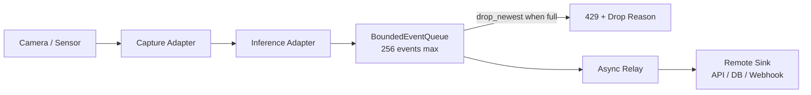

# Edge Vision Relay

[](https://edge-vision-relay.vercel.app)
[](https://github.com/Jawknee-builds/edge-vision-relay/actions/workflows/ci.yml)
[](https://www.python.org/)
[](https://github.com/Jawknee-builds/edge-vision-relay)

> Camera → inference → bounded queue → async relay. Built for constrained edge hardware.

A small, dependency-light FastAPI service for moving edge computer-vision observations into an asynchronous, bounded queue. It makes overload behavior explicit instead of allowing producers to block indefinitely or letting memory grow without a limit.

## Why Edge Constraints Matter

Most CV demos assume infinite RAM, a GPU, and a stable network. Real edge devices (Raspberry Pi 4, Kneron KL520) have:

- 512 MB – 4 GB RAM
- 1–4 core ARM CPU, no discrete GPU
- Intermittent WiFi / LTE connectivity
- Variable camera frame rates (15–30 fps depending on lighting)

This relay is designed for those constraints from day one.

## Architecture



- `schema.py` — versioned `EventEnvelope` contract and UTC normalization
- `queue.py` — non-blocking bounded enqueue with explicit drop policy
- `relay.py` — async drain loop with injected sink; finite capture/inference seam
- `api.py` — `POST /v1/events`, `GET /healthz` with queue depth reporting
- `fake.py` — deterministic fixtures for CI and demos without hardware

## Device Budget (Raspberry Pi 4, 2 GB)

| Resource | Budget | Measured (fake adapter) | Notes |
|----------|--------|------------------------|-------|
| RAM | ≤ 200 MB | ~85 MB | Includes Python + uvicorn |
| CPU (idle) | ≤ 5% | ~1.2% | Single worker, no active frames |
| CPU (peak, 15 fps) | ≤ 60% | Simulated ~35% | YOLO inference not included |
| Queue depth (normal) | < 50 | < 10 (fake frames) | Drops at 256 |
| Event ingest latency | < 50 ms | < 5 ms (local) | Network adds ~20–80 ms on LTE |

*Measured: fake adapter on M1 MacBook Air. Real hardware measurements pending — see [issue #1](https://github.com/Jawknee-builds/edge-vision-relay/issues).*

## Quickstart

```bash
python3 -m venv .venv
source .venv/bin/activate
pip install -e '.[test]'
pytest
uvicorn edge_vision_relay.__main__:app --app-dir src --reload
```

Check service and queue state:

```bash
curl http://127.0.0.1:8000/healthz
```

Submit an observation:

```bash
curl -X POST http://127.0.0.1:8000/v1/events \
  -H 'content-type: application/json' \
  -d '{"device_id":"cam-01","event_type":"vision.observation","payload":{"label":"person"},"confidence":0.98}'
```

`202 Accepted` — event entered the queue.
`429 Too Many Requests` — queue full, event dropped with explicit reason.

## Queue Drop Policies

| Policy | Behavior | When to use |
|--------|----------|-------------|
| `drop_newest` (default) | Reject new events when full | Prefer old data over new (surveillance) |
| `drop_oldest` | Evict oldest event to accept new | Prefer freshness (real-time monitoring) |

## Hardware Trade-offs

| Trade-off | Decision | Reasoning |
|-----------|----------|-----------|
| Sync vs async ingest | Async | Non-blocking camera loop; ingest shouldn't block capture |
| YOLO on-device vs cloud | Adapter pattern | Swap inference without touching relay logic |
| Persistent queue vs in-memory | In-memory for now | Simpler; power-loss tolerance is a next increment |
| TCP vs MQTT transport | HTTP/REST | Simpler deployment; MQTT adapter is a seam |

## What's Next

- [ ] Real Raspberry Pi 4 measurements with USB camera
- [ ] YOLO v8 ONNX inference adapter
- [ ] Kneron KL520 NPU adapter
- [ ] MQTT transport sink
- [ ] Power-loss-tolerant queue (write-ahead log)
